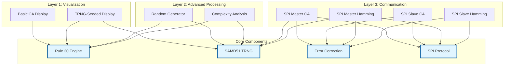
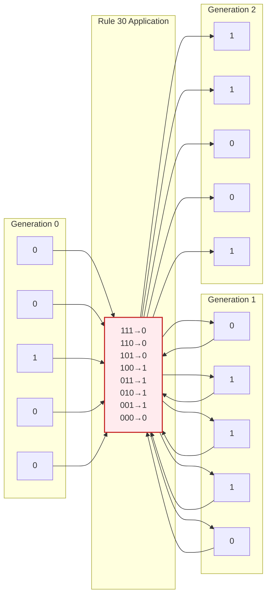
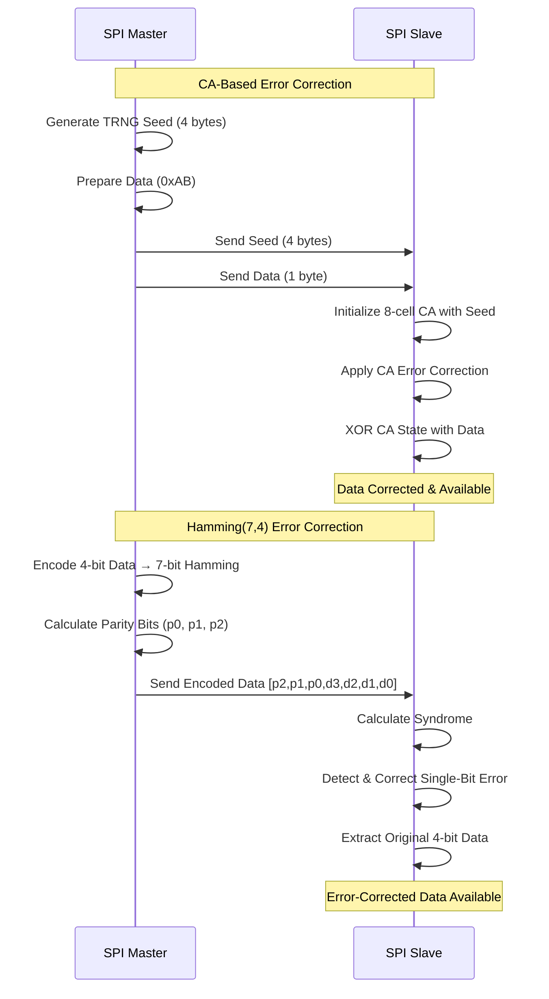
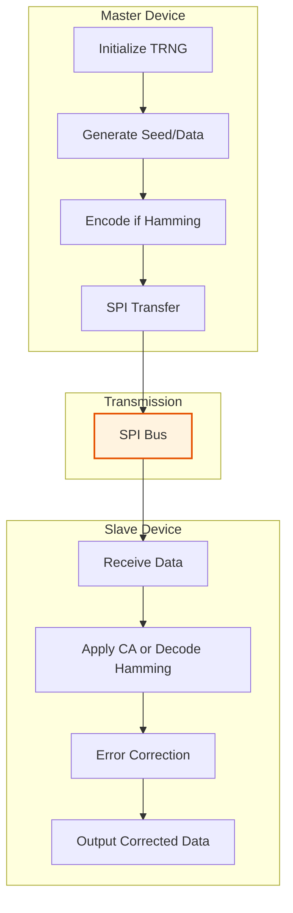
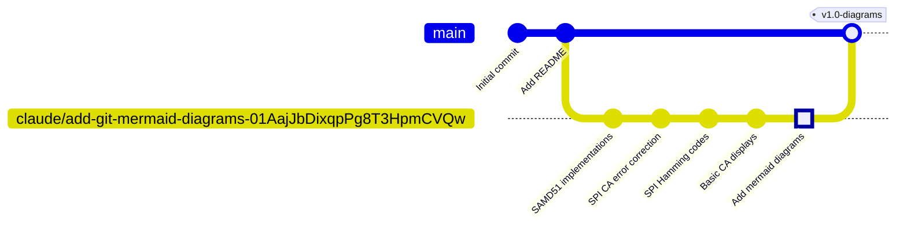

# GPT Cellular Automata

A comprehensive Arduino/SAMD51 implementation of one-dimensional cellular automata (1D CA) with applications in cryptography, error correction, and complexity analysis.

[](LICENSE)

## Table of Contents
- [Overview](#overview)
- [Repository Structure](#repository-structure)
- [Project Architecture](#project-architecture)
- [Components](#components)
- [Hardware Requirements](#hardware-requirements)
- [Quick Start](#quick-start)
- [SPI Communication](#spi-communication)
- [Applications](#applications)
- [Git Workflow](#git-workflow)
- [Contributing](#contributing)

## Overview

This project implements one-dimensional cellular automata on embedded systems, demonstrating their practical applications in:
- **True Random Number Generation** (TRNG-seeded CA)
- **Complexity Analysis** (Lempel-Ziv algorithm)
- **Error Correction** (CA-based and Hamming codes)
- **Inter-device Communication** (SPI Master-Slave)

## Repository Structure

```mermaid
graph TD
    A[GPT_cellular_automata] --> B[Basic Examples]
    A --> C[SAMD51 Advanced]
    A --> D[SPI Communication]
    A --> E[Documentation]

    B --> B1[OneDimensional_CA_Display.ino]
    B --> B2[OneDimensional_CA_TRNG_Seeded_Display.ino]

    C --> C1[SAMD51_CA_Random_Generator.ino]
    C --> C2[SAMD51_CA_Lempel_Ziv_Complexity.ino]

    D --> D1[SPI_Master_CA_Error_Correction.ino]
    D --> D2[SPI_Slave_CA_Error_Correction.ino]
    D --> D3[SPI_Master_Hamming_Error_Correction.ino]
    D --> D4[SPI_Slave_Hamming_Error_Correction.ino]

    E --> E1[README.md]
    E --> E2[LICENSE]

    style A fill:#f9f,stroke:#333,stroke-width:4px
    style B fill:#bbf,stroke:#333,stroke-width:2px
    style C fill:#bfb,stroke:#333,stroke-width:2px
    style D fill:#fbb,stroke:#333,stroke-width:2px
    style E fill:#ffb,stroke:#333,stroke-width:2px
```



### Current Directory Layout

```
GPT_cellular_automata/
├── LICENSE                                          # GNU GPL v2
├── README.md                                        # This file
├── OneDimensional_CA_Display.ino                   # Basic Rule 30 visualization
├── OneDimensional_CA_TRNG_Seeded_Display.ino       # TRNG-seeded Rule 30
├── SAMD51_CA_Random_Generator.ino                  # PRNG using CA
├── SAMD51_CA_Lempel_Ziv_Complexity.ino             # Complexity analysis
├── SPI_Master_CA_Error_Correction.ino              # CA-based error correction (Master)
├── SPI_Slave_CA_Error_Correction.ino               # CA-based error correction (Slave)
├── SPI_Master_Hamming_Error_Correction.ino         # Hamming(7,4) encoder (Master)
└── SPI_Slave_Hamming_Error_Correction.ino          # Hamming(7,4) decoder (Slave)
```

### Suggested Future Structure

For better organization as the project grows:

```
GPT_cellular_automata/
├── docs/                           # Documentation and diagrams
├── examples/
│   ├── basic/                     # Basic CA demonstrations
│   ├── samd51/                    # SAMD51-specific implementations
│   └── spi_communication/         # Master-Slave pairs
├── lib/
│   ├── ca_rules/                  # Reusable CA rule implementations
│   ├── trng_utils/                # TRNG utility functions
│   └── error_correction/          # Error correction algorithms
└── tests/                         # Unit tests and validation
```

## Project Architecture



### Cellular Automata Evolution



## Components

### 1. Basic Examples

#### OneDimensional_CA_Display.ino
- **Purpose**: Visualize Rule 30 cellular automaton evolution
- **Hardware**: Any Arduino board
- **Features**:
  - 32-cell array
  - Single center cell seed
  - Serial Monitor output (binary + decimal)
  - 500ms generation interval

#### OneDimensional_CA_TRNG_Seeded_Display.ino
- **Purpose**: CA with true random initialization
- **Hardware**: SAMD51 boards (e.g., Adafruit Metro M4)
- **Features**:
  - Hardware TRNG seeding
  - Rule 30 with XOR logic
  - 50 random numbers per cycle

### 2. SAMD51 Advanced Implementations

#### SAMD51_CA_Random_Generator.ino
- **Purpose**: Pseudorandom number generation
- **Algorithm**: TRNG-seeded Rule 30 CA
- **Output**: 50 PRNG values per cycle (32-bit decimal)

#### SAMD51_CA_Lempel_Ziv_Complexity.ino
- **Purpose**: Measure sequence complexity
- **Algorithm**: Lempel-Ziv compression analysis
- **Use Case**: Analyze randomness quality of CA outputs
- **Complexity Metric**: Higher = more random/complex

### 3. SPI Communication with Error Correction



#### CA-Based Error Correction Pair
- **SPI_Master_CA_Error_Correction.ino**: Transmits seed + data
- **SPI_Slave_CA_Error_Correction.ino**: Receives and corrects using CA state
- **Method**: XOR data with CA-generated pattern

#### Hamming Code Pair
- **SPI_Master_Hamming_Error_Correction.ino**: Encodes 4-bit → 7-bit Hamming(7,4)
- **SPI_Slave_Hamming_Error_Correction.ino**: Decodes and corrects single-bit errors
- **Parity Bits**: p0, p1, p2 provide error detection/correction

## Hardware Requirements

| Sketch | Board | Additional Hardware |
|--------|-------|---------------------|
| OneDimensional_CA_Display | Any Arduino | None |
| OneDimensional_CA_TRNG_Seeded_Display | SAMD51 | None |
| SAMD51_CA_Random_Generator | SAMD51 | None |
| SAMD51_CA_Lempel_Ziv_Complexity | SAMD51 | None |
| SPI_Master_* | SAMD51 | SPI Slave device |
| SPI_Slave_* | SAMD51 | SPI Master device |

### Recommended Boards
- **SAMD51**: Adafruit Metro M4, Adafruit Feather M4, Arduino Nano 33 IoT
- **Basic Arduino**: Uno, Mega, Nano (for display sketch only)

### SPI Wiring

For SPI Master-Slave communication:

```
Master (MOSI) → Slave (MOSI)
Master (MISO) ← Slave (MISO)  Pin 22 on Slave
Master (SCK)  → Slave (SCK)
Master (CS)   → Slave (SS)    Pin 10 on Master
GND           ← GND
```

## Quick Start

### Basic Visualization

1. Open `OneDimensional_CA_Display.ino` in Arduino IDE
2. Select your board and port
3. Upload the sketch
4. Open Serial Monitor (115200 baud)
5. Watch Rule 30 CA evolve over generations

### TRNG-Seeded Random Generation

1. Open `SAMD51_CA_Random_Generator.ino`
2. Connect SAMD51 board
3. Upload and open Serial Monitor
4. Observe hardware-seeded random numbers

### SPI Error Correction

1. Connect two SAMD51 boards via SPI (see wiring above)
2. Upload Master sketch to first board
3. Upload corresponding Slave sketch to second board
4. Monitor both Serial outputs
5. Observe error correction in action

## SPI Communication



## Applications

One-dimensional cellular automata (1D CAs) are systems in which a row of cells evolves through discrete time steps according to a set of rules based on the values of their neighborhood. Despite their simplicity, 1D CAs have found numerous applications:

### Computing & Cryptography
1. **Education**: Teaching automata, computation, complexity, and emergent behaviors
2. **Cryptography**: Encryption and pseudorandom number generation
3. **Random Number Generation**: Chaotic CA behavior for PRNGs in simulations
4. **Error-Correcting Codes**: Construction of error-correcting codes (demonstrated in this repo)
5. **Parallel Computing**: Easily parallelized CA for algorithm studies
6. **Quantum Computing**: 1D quantum CA as theoretical models for quantum computation

### Signal & Data Processing
7. **Signal Processing**: Filtering and feature extraction
8. **Image Processing**: Edge detection and enhancement by treating rows/columns as CA
9. **Neural Network Training**: CA-based training methods for ANNs
10. **Algorithmic Learning**: Machine learning and algorithmic learning experiments

### Modeling & Simulation
11. **Traffic Flow**: Simulating highway traffic and congestion
12. **Population Dynamics**: Spread of populations, diseases, or information
13. **Biology and Genetics**: Modeling linear cell arrays or genetic information
14. **Material Science**: One-dimensional material behavior modeling
15. **Ecological Modeling**: Linear ecological systems (e.g., species spread along rivers)

### Creative Applications
16. **Pattern Generation**: Generative art and procedural content
17. **Music Composition**: Mapping cell states to musical notes
18. **Game Development**: Procedural terrain, texture, and element generation

### Scientific Research
19. **Study of Complex Systems**: Complexity, self-organization, emergent behavior
20. **Understanding Physics**: Insights into causality, time, and fundamental concepts

As research continues, additional applications for 1D cellular automata continue to emerge. Their simplicity and ability to generate complex behavior from simple rules make them invaluable across numerous fields.

## Git Workflow



### Development Branches

This repository follows a feature-branch workflow:
- **main**: Stable releases
- **claude/***: Feature development branches (e.g., `claude/add-git-mermaid-diagrams-01AajJbDixqpPg8T3HpmCVQw`)

### Commit Conventions

- **feat**: New features (e.g., "feat: add Hamming error correction")
- **fix**: Bug fixes
- **docs**: Documentation updates
- **refactor**: Code refactoring without behavior changes
- **test**: Adding or updating tests

## Contributing

Contributions are welcome! Areas for expansion:

### Suggested Improvements

1. **Code Organization**
   - Refactor common TRNG functions into reusable library
   - Create header files for CA rule implementations
   - Organize sketches into subdirectories

2. **Documentation**
   - Add wiring diagrams
   - Create detailed hardware setup guides
   - Document CA rule variations (beyond Rule 30)

3. **New Features**
   - Implement additional CA rules (Rule 110, Rule 184)
   - Add 2D CA extensions
   - Create visualization tools (LED matrix output)
   - Add unit tests for error correction algorithms

4. **Performance**
   - Optimize CA evolution algorithms
   - Add benchmarking tools
   - Implement multi-threading for SAMD51

### How to Contribute

1. Fork the repository
2. Create a feature branch (`git checkout -b feature/amazing-feature`)
3. Commit your changes with clear messages
4. Push to your branch (`git push origin feature/amazing-feature`)
5. Open a Pull Request

## License

This project is licensed under the GNU General Public License v2.0 - see the [LICENSE](LICENSE) file for details.

## Acknowledgments

- Cellular automata theory: Stephen Wolfram's "A New Kind of Science"
- SAMD51 hardware TRNG implementation
- Arduino and Adafruit communities

---

**Project Status**: Active Development
**Last Updated**: 2025-11-14
**Maintainer**: GPT Cellular Automata Project
